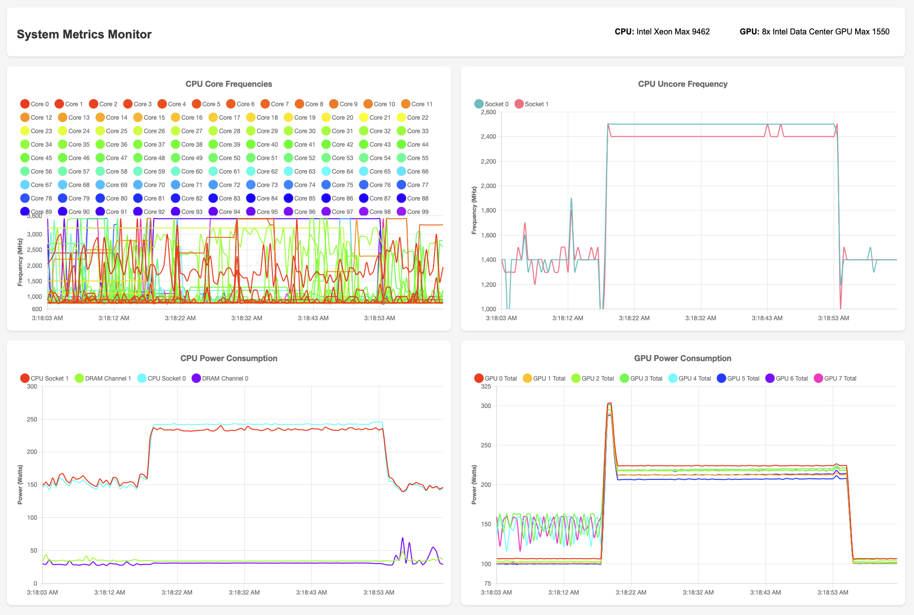

# System Monitoring Tool Docs



## Overview
This monitoring tool provides real-time monitoring capabilities for both Intel CPU and Intel Ponte Vehhicio GPU metrics on Linux systems. 

### Features
- Real-time CPU monitoring:
  - Core frequencies
  - Uncore frequencies
  - Power consumption (RAPL)
  - DRAM power consumption
- GPU monitoring via Level Zero API:
  - Card-level power consumption
  - Per-tile power metrics
  - Device enumeration and properties
  - Multi-GPU support
  - Painless access to granular GPU power readings

## Project Structure
```
.
├── CMakeLists.txt            # CMake configuration
├── gpu_power_bindings.cpp    # pybind11 bindings for GPU monitoring
├── gpu_power.hpp             # C++ header for GPU monitoring
├── monitor.html              # Web interface
├── monitor.py                # Main Python monitoring server
└── utils/                    # Utility scripts and tools
```

## Requirements
- Linux operating system
- Root privileges (for MSR access)
- Python 3.12
- CMake 3.10+
- pybind11
- Level Zero (oneAPI) development packages

### Dependencies Installation
```bash
# Install dependencies (for oneAPI follow the guide at the root of this repo)
sudo apt-get install cmake python3.12-dev
sudo apt-get install pybind11-dev

# Load MSR module if not already loaded
sudo modprobe msr
```

## Building the Project

1. Create and enter build directory:
```bash
mkdir build && cd build
```

2. Configure with CMake:
```bash
cmake ..
```

3. Build:
```bash
make
```

This will generate the Python module `gpu_power.cpython-*.so` that will be imported by the monitoring script.

## Running the Monitor

1. Start the monitoring server:
```bash
sudo python3 monitor.py
```

2. Access the web interface:
```
http://localhost:8030
```

## Architecture Details

### GPU Monitoring (C++)
The GPU monitoring component uses Intel's Level Zero API to access GPU metrics:

- `GPUPowerData`: Structure containing power metrics for a single GPU
  - `gpu_name`: Device name
  - `uuid`: Unique device identifier
  - `card_power`: Total card power consumption
  - `tile0_power`, `tile1_power`: Per-tile power consumption

- `GPUPowerMonitor`: Main monitoring class
  - `initialize()`: Sets up monitoring for available devices
  - `getPowerReadings()`: Returns current power readings for all GPUs

### Python Integration
The C++ GPU monitoring code is exposed to Python using pybind11:

```cpp
PYBIND11_MODULE(gpu_power, m) {
    py::class_<GPUPowerData>(m, "GPUPowerData")
        .def_readwrite("gpu_name", &GPUPowerData::gpu_name)
        .def_readwrite("uuid", &GPUPowerData::uuid)
        .def_readwrite("card_power", &GPUPowerData::card_power)
        .def_readwrite("tile0_power", &GPUPowerData::tile0_power)
        .def_readwrite("tile1_power", &GPUPowerData::tile1_power);

    py::class_<GPUPowerMonitor>(m, "GPUPowerMonitor")
        .def(py::init<>())
        .def("initialize", &GPUPowerMonitor::initialize)
        .def("get_power_readings", &GPUPowerMonitor::getPowerReadings);
}
```

### Web Interface
The web interface (`monitor.html`) provides real-time visualization using Chart.js:
- Four main charts:
  - CPU Core Frequencies
  - CPU Uncore Frequency
  - CPU Power Consumption
  - GPU Power Consumption
- Auto-updating every 500ms (can be changed)

## Common Issues and Troubleshooting

1. MSR Access:
```bash
# If you see "Error reading MSR", ensure the module is loaded:
sudo modprobe msr
```

2. Permission Issues:
```bash
# The monitor must be run as root:
sudo python3 monitor.py
```

3. Missing GPU Readings:
- Ensure Level Zero drivers are installed and GPU is recognized
- Check dmesg for driver issues

## Authors
Seyfal Sultanov, EVL